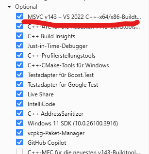
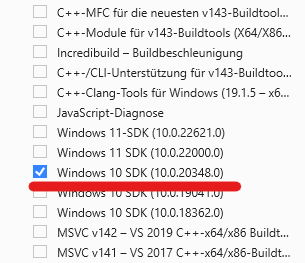

# .backup System
by Tamino1230

A simple, global backup utility for Windows, written in C++. Includes a user-friendly installer and uninstaller for easy setup and removal.

---

Future Plans:
Adding .backupignore file compability
For not backing up unwanted folders/files

---

## For running .backup ->
You need to have installed (from Visual Studio):  
[Visual Studio Community Edition](https://visualstudio.microsoft.com/vs/community/) or higher with the following components:  
- **Desktop development with C++**  
- **MSVC v142 - VS 2019 C++ x64/x86 build tools**  
- **Windows 10 SDK (10.0.18362.0)**  

Ensure these are selected during installation or added via the Visual Studio Installer.




---


## Bugs
`backup remove-command` not implemented in Commandprompt/PowerShell yet. Please use `setup.bat`.

---

## Preview


---

## Features
* Create backups in `.backup/` directory
* Global command-line usage: `backup init`, `backup do`, `backup auto --min X`
* Remove all backups or just the command
* Menu-driven installer/uninstaller (`setup.bat`)
* No admin rights required for backup usage (only for install/uninstall)
* **Meta info:** `backup init` creates a `.backup/__init__` file with metadata (author, folder, timestamp, and init status)
* **Safety:** All commands except `init`, `meta`, and `help` require initialization first
* **View meta:** Use `backup meta` to display backup metadata

---

## File Overview

| File/Folder         | Purpose                                                      |
|--------------------|-------------------------------------------------------------- |
| `source/backup.cpp`| Main C++ source code for backup utility                       |
| `exe/backup.exe`   | Compiled executable (gets used by setup.py)                   |
| `setup.bat`        | Main menu-driven installer/uninstaller (recommended)          |
| `.backup/`         | (Created by tool) Directory where backups are stored          |
| `source/testscript.cpp`   | Used for future Code |

---

## Installation & Removal

### Recommended: Menu Setup
Run `setup.bat` and follow the menu prompts to install or uninstall the backup command and PowerShell alias.

```cmd
setup.bat
```

### Manual Setup
Removed `install.bat` and `uninstall.bat` and got replaced with `setup.bat`

---

## How It Works

- **setup.bat**: Provides a menu to install or uninstall the backup command. Handles copying `backup.exe`, setting/removing the PowerShell alias, and updating the PATH. Shows a summary after each operation.
- **backup.exe**: The actual backup tool. Use it from any CMD or PowerShell window after installation.

---

## Usage

After installation, use the following commands globally in CMD or PowerShell:

| Command                        | Description                        |
|--------------------------------|------------------------------------|
| `backup init`                  | Initialize backup system           |
| `backup do`                    | Create a backup                    |
| `backup auto --min X`          | Run automatic backups every X mins |
| `backup remove --all`          | Remove all backups                 |
| `backup remove-command`        | Unregister the backup command      |
| `backup meta`                  | Show backup meta information       |
| `backup help`                  | Show available commands            |

> **Note:**
> - You must run `backup init` before using any other command (except `meta` and `help`).
> - `backup init` creates `.backup/__init__` with metadata: `init: True`, author, folder, and timestamp.
> - `backup meta` displays this metadata.

---

## Development

To build the backup tool from source:

### Building the Backup Tool

1. **Open the Project in Visual Studio:**
    - Launch Visual Studio.
    - Go to **File > Open > File...** and select `source/backup.cpp`.
    - (Optional) Create a new empty C++ project and add `backup.cpp` to it for easier management.

2. **Configure Build Settings:**
    - Set the project to use the C++17 standard (Project Properties > C/C++ > Language > C++ Language Standard > ISO C++17 Standard).
    - Set the output directory to `exe\` (Project Properties > Configuration Properties > General > Output Directory).

3. **Build the Executable:**
    - Press **Ctrl+Shift+B** or select **Build > Build Solution**.
    - After building, ensure that `backup.exe` is created in the `exe\` folder.

4. **Move the Executable (if needed):**
    - If the executable is not in the `exe\` directory, manually move the built `backup.exe` from the project's output folder (e.g., `Debug` or `Release`) to the `exe\` directory at the root of your repository.

> **Tip:** You can also use the Visual Studio Developer Command Prompt to build with `cl`, but using the Visual Studio IDE is recommended for easier configuration and error checking.


---

## License

MIT License

[View License](LICENSE)

---

## Contact

Contact me on Discord: [Tamino1230](https://discord.com/users/702893526303637604)