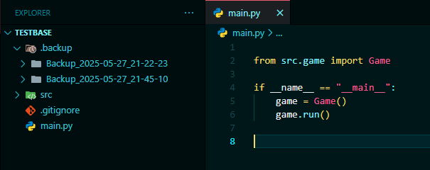
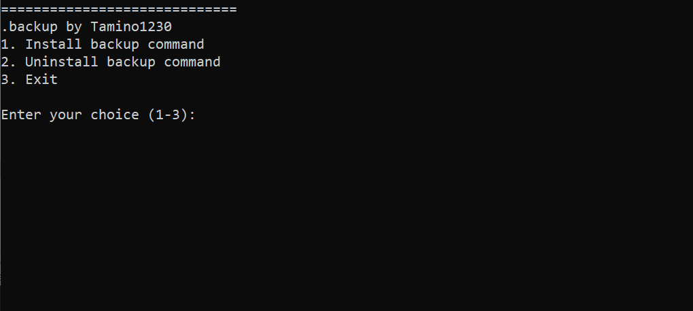
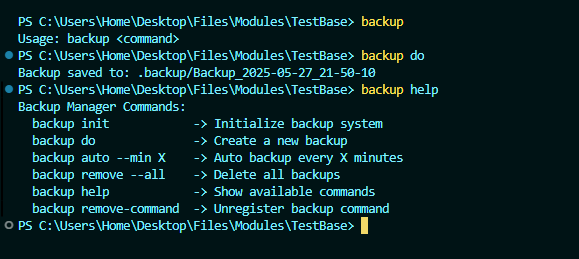

# AutoBackup System

A simple, global backup utility for Windows, written in C++. Includes a user-friendly installer and uninstaller for easy setup and removal.

---

## Bugs
`backup remove-command` not implemented in Commandprompt/PowerShell yet. Please use `setup.bat`.

---

## Preview






---

## Features
* Create backups in `.backup/` directory
* Global command-line usage: `backup init`, `backup do`, `backup auto --min X`
* Remove all backups or just the command
* Menu-driven installer/uninstaller (`setup.bat`)
* No admin rights required for backup usage (only for install/uninstall)

---

## File Overview

| File/Folder         | Purpose                                                      |
|--------------------|-------------------------------------------------------------- |
| `source/backup.cpp`| Main C++ source code for backup utility                       |
| `exe/backup.exe`   | Compiled executable (gets used by setup.py)                   |
| `setup.bat`        | Main menu-driven installer/uninstaller (recommended)          |
| `.backup/`         | (Created by tool) Directory where backups are stored          |

---

## Installation & Removal

### Recommended: Menu Setup
Run `setup.bat` and follow the menu prompts to install or uninstall the backup command and PowerShell alias.

```cmd
setup.bat
```

### Manual Setup
```
Removed `install.bat` and `uninstall.bat` and got replaced with `setup.bat`
```

---

## How It Works

- **setup.bat**: Provides a menu to install or uninstall the backup command. Handles copying `backup.exe`, setting/removing the PowerShell alias, and updating the PATH. Shows a summary after each operation.
- **backup.exe**: The actual backup tool. Use it from any CMD or PowerShell window after installation.

---

## Usage

After installation, use the following commands globally in CMD or PowerShell:

| Command                        | Description                        |
|--------------------------------|------------------------------------|
| `backup init`                  | Initialize backup system           |
| `backup do`                    | Create a backup                    |
| `backup auto --min X`          | Run automatic backups every X mins |
| `backup remove --all`          | Remove all backups                 |
| `backup remove-command`        | Unregister the backup command      |

---

## Development

To build the backup tool from source:

1. Open `source/backup.cpp` in Visual Studio (or any C++ IDE), and build, or  
2. Download and install the [Build Tools for Visual Studio](https://visualstudio.microsoft.com/visual-cpp-build-tools/) so that the `cl` compiler is available on your system.
2. Use the command line:

> **Note:** For best results, open the project in Visual Studio 2022 Developer Command Prompt before building.
```cmd
cl source\backup.cpp /std:c++17 /Fe:exe\backup.exe
```

---

## License

MIT License

[View License](LICENSE)

---

## Contact

Contact me on Discord: [Tamino1230](https://discord.com/users/702893526303637604)